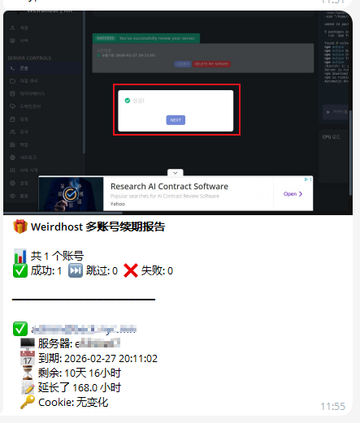
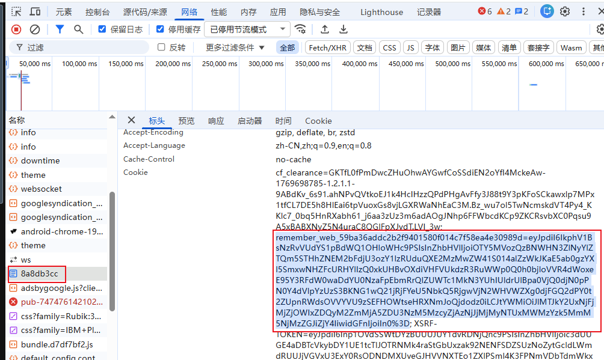

# ⭐ Star 星星走起 动动发财手点点 ⭐
Weirdhost &amp; 自动续期 &amp; 多账号版

### 注册地址：https://hub.weirdhost.xyz



### ✅ 需要添加的 Secrets

> 进入仓库：**Settings → Secrets and variables → Actions → New repository secret**

| Secret 名称 | 示例值 | 说明 |
|:--|:--|:--|
| `WEIRDHOST_ACCOUNTS` | `ACCOUNTS 格式` | 账号配置 JSON 注意:`Cookie不要填到这里` |
| `WEIRDHOST_COOKIE_1` | `remember_web_59ba36addc2b2f940` | 账号1 的 Cookie |
| `WEIRDHOST_COOKIE_2` | `remember_web_59ba36addc2b2f940` | 账号2 的 Cookie |
| `WEIRDHOST_COOKIE_3` | `remember_web_59ba36addc2b2f940` | 账号3 的 Cookie |
| ... | `remember_web_59ba36addc2b2f940` | 更多账号... |
| `REPO_TOKEN` | `ghp_xxxxxxxxxxxx` | GitHub PAT（自动更新 Cookie） |
| `TELEGRAM_BOT_TOKEN` | `123456789:ABC-XYZ...` | Telegram Bot Token |
| `TELEGRAM_CHAT_ID` | `123456789` | Telegram Chat ID |

---

### 📌 ACCOUNTS 格式

```json
[
  {
    "remark": "备注账号一",
    "id": "8a8db3cc",
    "cookie_env": "WEIRDHOST_COOKIE_1"
  },
  {
    "remark": "备注账号二",
    "id": "e13623",
    "cookie_env": "WEIRDHOST_COOKIE_2"
  }
]

[
  {
    "remark": "app",
    "id": "46fa3dfe",
    "cookie_env": "FREEGAMEHOST_COOKIE_1"
  }
]
```

---

### 📌 Cookie 格式（参考示例）

你可以按下图输出的格式填入 `WEIRDHOST_COOKIE_1`：



---
